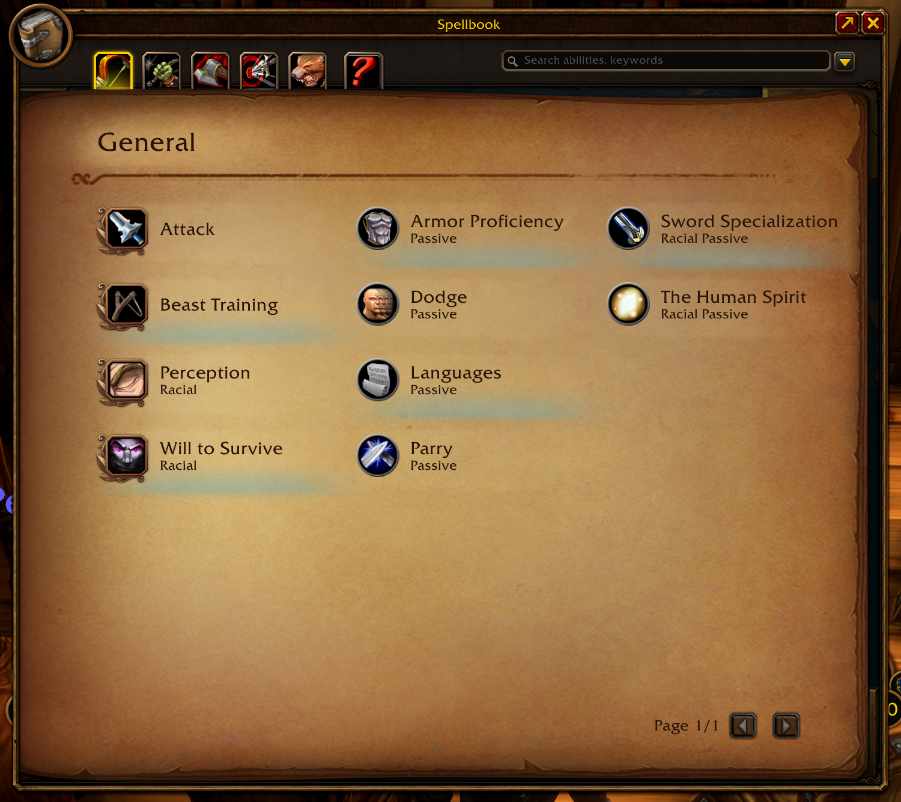
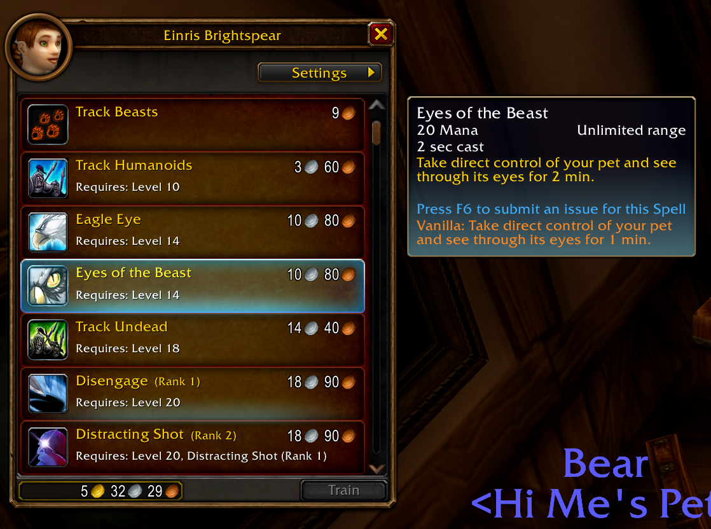
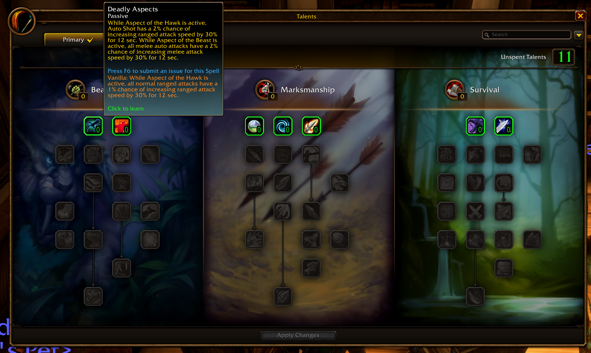
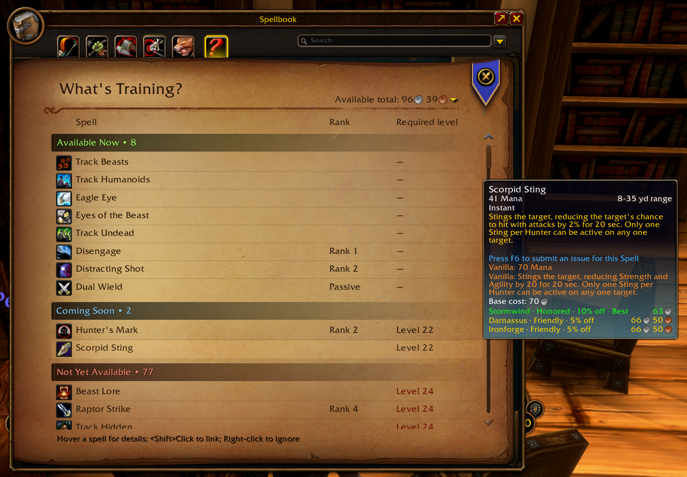
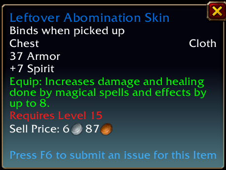
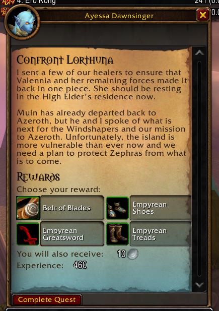
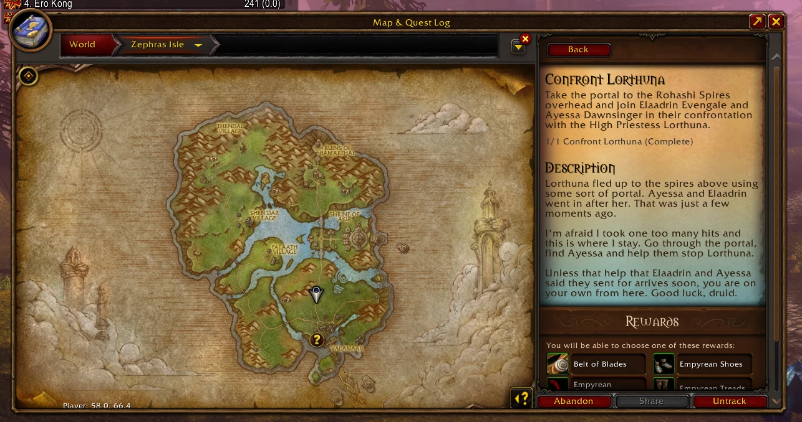

# Forever Changes

A small addon for **World of Warcraft: Forever** that tints what is new or different compared with original Classic (vanilla): quests, items and spells get a light teal glow, and changed spells show how they were in vanilla.

Vanilla quests keep the normal parchment. Everything new to Forever gets a teal gradient rising from the bottom of the page, and a small infinity-sign marker after its name in the quest log list and the objective tracker. New items, and new or changed spells, get the same glow in their tooltips, and spells also in the spellbook and at the trainer.

**Spellbook**

**Class trainer**

**Talents**

**WhatsTraining**

**New items tooltip**

**Quests**

| Quest giver window | Map & Quest Log |
| --- | --- |
|  |  |

## Install

1. Download the latest release zip.
2. Extract it so you have `World of Warcraft\_classic_beta_\Interface\AddOns\ForeverChanges`.
3. Restart the game or type `/reload`.

## Options

Type `/fchanges`, or open **Options → AddOns → Forever Changes**.

- **Tint the parchment teal**: on by default.
- **Tint the tooltips of items new to Forever**: on by default. Adds the teal glow to the bottom of the tooltip of any item that was not in original Classic.
- **Tint new and changed spells**: on by default. Adds the teal glow to spells that are new in Forever or differ from Classic, in the spellbook, at the trainer and in their tooltips.
- **Show vanilla values of changed spells**: on by default. Adds orange lines to the tooltip of a changed spell with how it was in vanilla: the cost, cast time, cooldown, range and description that differ.
- **Tint colour**: the colour of the overlay.
- **Bottom opacity**: strength of the teal at the bottom of the page.
- **Top opacity**: strength where the fade ends. `0%` fades out completely.
- **Fade length**: how far up the parchment the fade reaches.
- **Quest name marker**: an infinity sign after the name of non-vanilla quests, in the quest log list and the objective tracker.
  - Show or hide it, and put it at the start of the name instead of the end.
  - By default it is a small icon; you can set its height, nudge it up or down to line up with the text, and adjust its spacing from the name. Or switch to a plain text symbol (up to 4 characters, so you can use any character the game's font has).
  - By default it uses the tint colour; turn that off to pick its own colour.

- **Quest objectives**: off by default. Recolours the objective lines of non-vanilla quests (in the quest log list and the tracker) from white to the tint colour, or a colour of your choice. Completed and failed objectives keep their own colours.

`/fchanges id` prints the ID of the quest you have open, and whether the addon considers it vanilla.

## How it decides what is vanilla

The addon contains a list of the quest IDs that existed in original Classic (`VanillaQuests.lua`). Any quest not on that list is tinted. The list was generated from the Classic quest database in [Questie](https://github.com/Questie/Questie). A few genuine vanilla quests may be missing, and would show as teal. If you spot one, open an issue with the ID from `/fchanges id`.

Only quests that are open in a quest window are tinted. Gossip windows have no quest ID, so they are left alone.

Spells are decided by comparing the game data of Forever with Classic Era (`SpellData.lua`, generated by `python tools/make_spell_data.py` from the tables on [wago.tools](https://wago.tools)). A spell is new if Classic had no such spell (spells that only exist in Season of Discovery count as new), and changed if its cost, cast time, cooldown, range, stance or description differs. The orange vanilla text is only added where the vanilla value could be worked out exactly, so some changed spells are tinted without it.

## Notes

- Built for the Forever beta (interface `16001`). It relies on Blizzard's quest log art, so it may need updates if that changes.

## Licence and credits

GPL-3.0-or-later. See [LICENSE](LICENSE). The vanilla quest list is derived from Questie's data, which is GPL-3.0 licensed.

Forever Changes is a modified fork (2026) of Forever Quest Tint by Alex Diakovsky (xanastar), which is also GPL-3.0-or-later. The changes are listed in the [changelog](CHANGELOG.md).

Not affiliated with or endorsed by Blizzard Entertainment. World of Warcraft is a trademark of Blizzard Entertainment.
